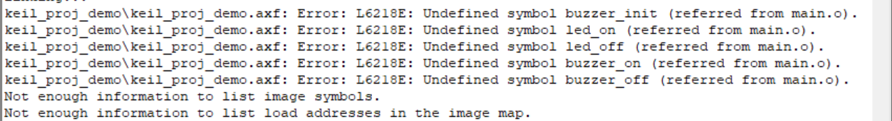

# 乔靖轩 2026.8.7
## 8.7：编译烧录与工具链
### 1. 确认工具链：
 复位后，LED闪烁5次，蜂鸣器响一次。此为一循环并往复。

### 2. 认识编译产物：
F7完成编译+链接两步：
1. 编译：把源码生成.o目标文件
2. 链接：将所有的.o、库文件整合，生成.axf文件
   
F8写入.axf文件。

 - 编译：芯片运行的是Flash里的机器码，而非.c源码，因此更改完.c源码后需要重新编译以更新Flash里的机器码（个人理解：每次更新完都需要将Flash向.c源码同步）
       
 - 下载：把新的.hex覆盖写入Flash
  
### 3. 配置工程：
   - 移除 Include Paths 里的 ..\hardware\inc，显示以下报错：
   
   - 移除 hardware Group 里的 buzzer.c 和 led.c，显示以下报错：
     

### 4. 修改现象验证闭环：
   - 把 DELAY_MS 从 250U 改成 500U后，延时翻倍
  
### 5. 工具链记录
   - 新建工程，选择对应STM32芯片内核；
      1. 导入HAL库驱动文件，分组归类Drivers、Core、hardware、user；
      2. C/C++配置：添加所有.h头文件检索路径；
      3. Debug配置：选择下载器（ST-Link），开启下载后自动复位运行；
      4. 编译检查无报错，首次下载调试。
  
   - 额，除了今天作业里主动产生的报错，我忘了还遇见过什么报错了，那就总结这两种了。
   - 遇到报错与解决方案
     1. xxx.h file not found
        原因：头文件路径未添加/路径拼写错误
        解决：在Include Paths补充对应文件夹路径

     2. Undefined symbol
        原因：.c实现文件未加入工程
        解决：将对应c文件添加到工程分组